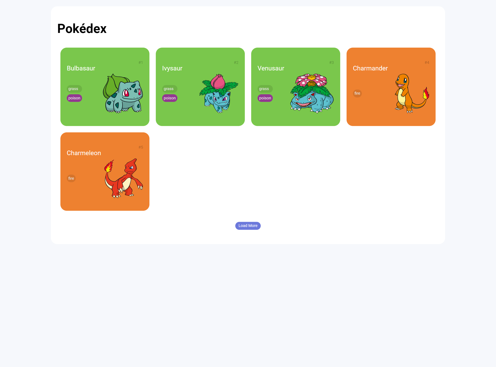

# Trilha JS Developer - Pokédex

### Descrição
Desafio de Projeto proposto no bootcamp **Desenvolvimento Front-End Angular** da [DIO](https://www.dio.me/en). Desde a faculdade nunca deixei de programar, seja por estudo ou trabalho, poucas às vezes tirei um tempo para fazer algo por lazer. Como todo bom jovem dos anos 2000, o Pokémon é uma das séries de anime que mais gosto e fazer esse projeto aqui foi muito além da carga horária, fiz com muito prazer, foi divertido.

Uma outra coisa muito boa durante os estudos foram as dicas de refatoração de código, dicas muito boas de css e javascript (`Promisse.all`) isso eu não quero esquecer nunca e usar sempre. Durante o curso, contruímos uma Pokedéx, usando a [PokeApi](https://pokeapi.co/docs/v2#pokemon).

O desafio proposto aqui foi: **criar a tela de detalhes para um pokémon selecionado na tela princial**. A empolgação me levou a alterar um pouco a tela inical.

#### Tela de Detalhes
A tela de detalhes apresenta as informações do Pokémon selecionado na tela inicial. O id do Pokémon é passado via query params, e utilizado para fazer uma nova requisição a [PokeApi](https://pokeapi.co/docs/v2#pokemon). Uma das coisas legais da tela é que o fundo muda de acordo com o tipo principal do Pokémon.

#### Screeshots
###### Pokédex DIO x Minha Pokedéx

###### Desafio: Telas de Detalhes (Responsiva)
 

#### Links
Segue alguns links que utilizei durante a construção.

* [PokeApi](https://pokeapi.co/docs/v2#pokemon)
* [Open Method](https://developer.mozilla.org/en-US/docs/Web/API/Window/open)
* [Back Method](https://developer.mozilla.org/en-US/docs/Web/API/History/back)
* [URLSearchParams](https://developer.mozilla.org/en-US/docs/Web/API/URLSearchParams)